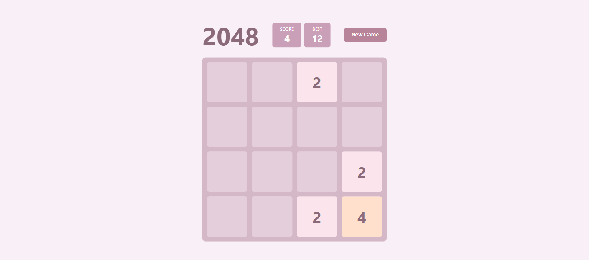

# 2048

A classic 2048 puzzle game built with vanilla HTML, CSS, and JavaScript. Open `index.html` in any browser to play.

## How to Play

- Use **arrow keys** (↑ ↓ ← →) to slide tiles
- When two tiles with the same number touch, they merge into one
- Reach the **2048** tile to win

## Features

- Smooth tile animations (slide + pop effects)
- Score tracking with local best record (persisted in localStorage)
- Responsive 480px board with classic tile color scheme
- Zero dependencies — single HTML file, double-click to play

## Screenshot

